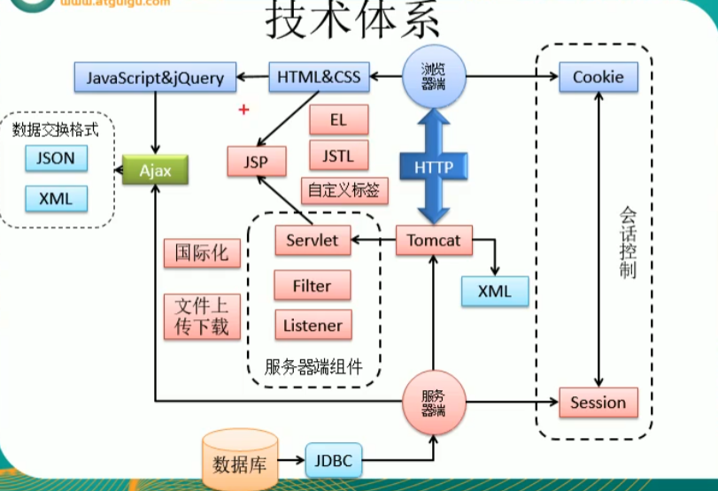
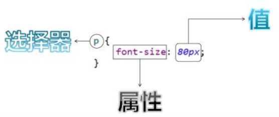
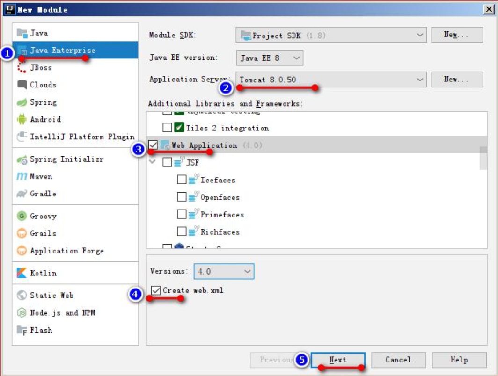
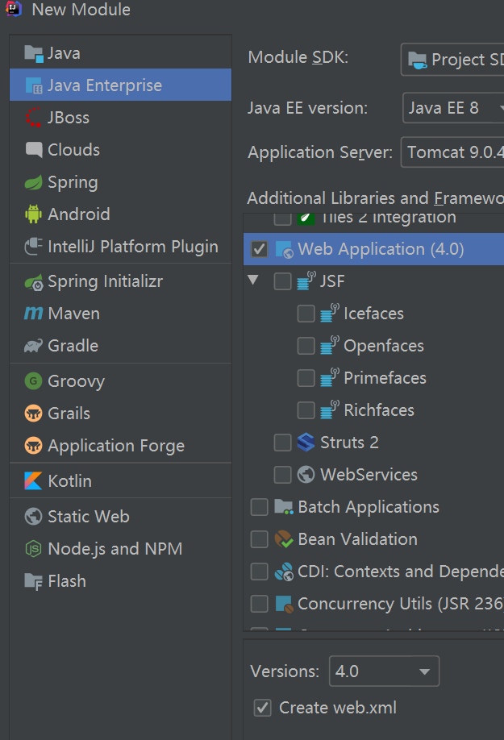
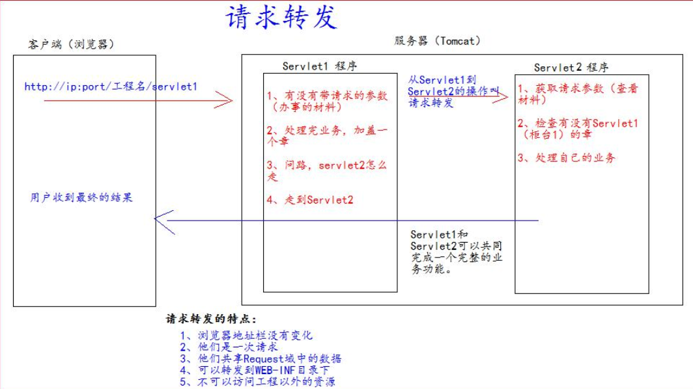
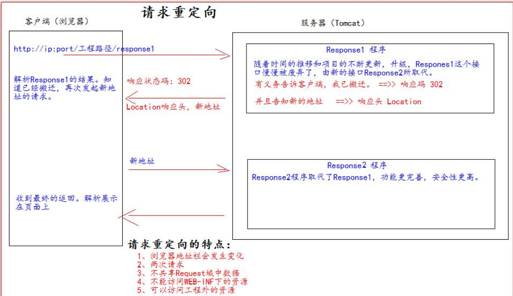
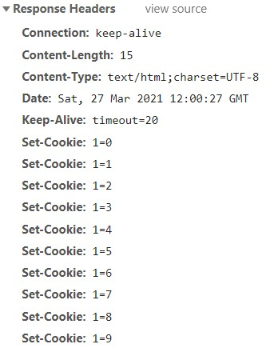

# Java Web-note

本笔记基于[尚硅谷](http://www.atguigu.com/)雷丰阳老师的课程, 主要对java后端开发人员 `web` 入门所需的基础知识 `html, css, js, tomcat` 及传统 Javaweb三大组件 `servlet, filter, listener`  及其他知识点进行了提炼和介绍

written by [Zayn Xu](https://github.com/ZaynXu)

[TOC]


# Java Web

---

### 知识体系



## HTML

---

- 负责呈现网页的内容(结构)
- 书写规范

    ```html
    <html> 								表示整个 html 页面的开始
        <head> 							头信息
        	<title>标题</title> 		  标题
        </head>
        <body> 							body 是页面的主体内容
        	页面主体内容
        </body>
    </html> 							表示整个 html 页面的结束
    <!--注释的写法-->
    ```

## CSS

---

- 负责呈现网页的表现形式,如布局,颜色,大小等
- 语法规则

    

    - 选择器： 浏览器根据“选择器” 决定受 CSS 样式影响的 HTML 元素（标签） 。
    - 属性 (property) 是你要改变的样式名， 并且每个属性都有一个值。 属性和值被冒号分开， 并 由花括号包围， 这样就组成了一个完整的样式声明（declaration） ， 例如： p {color: blue}
    - 多个声明： 如果要定义不止一个声明， 则需要用分号将每个声明分开。 虽然最后一条声明的 最后可以不加分号(但尽量在每条声明的末尾都加上分号)
- CSS 注释：

    ```css
     /*注释内容*/
    ```

- CSS与HTML结合
    1. 在标签的 style 属性上设置”key:value value;”， 修改标签样式
        - 这种方式的缺点？

            1.如果标签多了,样式多了,代码量非常庞大

            2.可读性非常差

            3.Css 代码没什么复用性可方言

    2. 在 head 标签中， 使用 style 标签来定义各种自己需要的 css 样式。 格式如下：

        ```css
        div {
        	Key : value1 value2;
        }
        ```

        - 这种方式的缺点。 1.只能在同一页面内复用代码， 不能在多个页面中复用 css 代码。 2.维护起来不方便， 实际的项目中会有成千上万的页面， 要到每个页面中去修改。 工作量太大了。
    3. 把 css 样式写成一个单独的 css 文件， 再通过 link 标签引入即可复用。 使用 html 的  标签 导入 css 样式文件。
- CSS选择器
    - 标签名选择器
        - 标签名选择器的格式是：

        ```css
        标签名{ 
        	属性： 值;
         }
        ```

        - 可以决定哪些标签被动的使用这个样式。
    - id 选择器
        - id 选择器的格式是：

        ```css
        #id 属性值{ 
        	属性： 值;
        }
        ```

        - 可以让我们通过 id 属性选择性的去使用这个样式
    - class 选择器(类选择器)
        - class 类型选择器的格式是：

        ```css
        **.**class 属性值{ 
        	属性： 值; 
        }
        ```

        - class 类型选择器， 可以通过 class 属性有效的选择性地去使用这个样式。
    - 组合选择器
        - 组合选择器的格式是：

            ```css
            选择器 1， 选择器 2， 选择器 n{ 
            	属性： 值; 
            }
            ```

        - 组合选择器可以让多个选择器共用同一个 css 样式代码。

## JavaScript

---

- JS简介&HelloWorld
    - JavaScript是一门客户端脚本语言，设计之初是为了解决客户端表单验证问题
      
        - js是动态类型语言、弱类型语言、基于原型的语言
    - JS用于开发网页行为
    - HelloWorld
    1. 写在script标签里面
    
            ```html
            <script type="text/javascript">
                //编写js代码
                windows.onload=function(){
                    //1、找到元素
                	var btnEle=document.getElementById("btn");
                	//2、绑定单击事件
                    btnEle.onclick=function(){
                	//3、为单击事件赋值一个响应方法
                        alert("FxxkWorld");
                    }
                }  
        </script>
    
            <btn id="btn">点击我</btn>
        
        ```
        
        ```
    
- js基本语法
    - 变量
        - 声明：var 变量名
        - 赋值：变量名=值; （可接受任何类型的值，也可以动态改值）
    - 函数
        - 声明：
            1. function 方法名(参数表){方法体}
            2. var 变量名=function(){方法体}
        - 调用
            1. 方法名(参数)
            2. 变量名(参数列表)
    - 对象
        - 声明：
            1. var obj=new Object();
            2. var obj2={};
        - 为对象添加属性和方法：
            1. 对象.属性名=值;
            2. 对象.属性名=function(){}
        - 对象
            - 声明:
                1. var obj=new Object();
                2. var obj2={};
            - 为对象添加属性和方法:
                - 对象.对象名=值;
                - 对象.属性名=function(){}
            - 获取:
                1. alert(对象.属性名); //查看属性
                2. 对象.属性名(); //调用方法
- js事件:用户与文档.比如:点击按钮,鼠标移动,文档加载完成
    - 事件响应的方式:
        1. 元素的事件属性

            ```html
            <button onclick="js代码"></button>
            ```

        2. 为找到的元素添加事件的响应方法
        3. 当事件触发,浏览器就会自动调用响应函数
- js加载方式:(如何在页面上嵌入js代码)
    1. 元素的事件属性上编写js代码(不推荐)
    2. 写在 script标签里面
        1. 写在window.onload=function(){

            //代码

            }

        2. 封闭之前

             不用写window.onload就可以找到元素

        3. 通过外部文件引入

            ```html
            <script type="text/javascript" src="指定外部js文件路径(相对路径)">
                //通过引入的方式,不能在引入文件的script标签里写代码
            </script>
            ```

- dom 文档对象模型
    - 浏览器把每个html页面抽象成了一个document对象，包括页面中所有的元素
    - dom模型是一个树形模型，模型中每一个元素都是节点
      
        - 父节点、子节点、祖先节点、后代节点、兄弟节点
    - 节点Node——构成html文档中最基本的单元
    - 节点分为三类
        - 元素节点：html文档中的html标签
        - 属性节点：元素的属性, 使用需要手动调用ele.getAttributeNode(“属性名”);
        - 文本节点：html标签中的内容,不同位置的节点都会被封装为文本节点
        - **元素节点可以拥有类型属性节点、文本节点、注释节点的子节点, 但属性节点 不参与层级关系**
    - 所有的节点都有三个属性
        - nodeName：节点名，即标签名
        - nodeType：节点类型
        - nodeValue：节点值
    - 不同节点不同属性的对比
    
            ```
            name      nodeName    nodeType     nodeValue
            元素节点	标签名	    1	           null
            属性节点	属性名	    2	           属性值
            文本节点	#test	      3	           文本内容
        ```
        
        ```
    
    - node用于dom查询常用方法：
        - getElementbyId()：通过id属性的值获取一个元素节点对象
        - getElementsbyTagName()：通过标签名获取一组元素节点对象
        - getElementsbyName()：通过name属性获取一组元素节点对象
    - node常用属性：
        - childNodes 属性， 获取当前节点的所有子节点
        - firstChild 属性， 获取当前节点的第一个子节点
        - lastChild 属性， 获取当前节点的最后一个子节点
        - parentNode 属性， 获取当前节点的父节点
        - nextSibling 属性， 获取当前节点的下一个节点
        - previousSibling 属性， 获取当前节点的上一个节点
        - className 用于获取或设置标签的 class 属性值
        - **innerHTML**属性， 表示获取/设置起始标签和结束标签中的HTML代码片段
        - **innerText** 属性， 表示获取/设置起始标签和结束标签中的文本
- 获取子节点时数量不对可能是由于文档中的空格被当作文本节点导致的
  
    ```html
    //获取节点某个属性的值: 
    <button id="btn" class="btn01">点击</button>
    //设置节点某个属性的值
    节点.属性名=新值;
    btnEle.id="btn0001";
    ```
```
    
    - dom增删改常用方法：
        1. 创建节点
            - var ele=document.createElement(“标签名”) 创建元素节点并返回，但不会自动添加到文档中
            - var textEle=document.createTextNode(“文本值”) 创建文本节点并返回，但不会自动添加到文档中
            - //组装 ele.appendChild(textEle);
        2. 添加节点
            - element.appendChild(ele) 将ele添加到element所有子节点后面
        3. 删除节点
            - 先找到要删除节点的父节点
            - 找到要删除的节点
            - 删除节点
                - 父节点.removeChild();
        4. 替换节点
            1. 找到要替换节点的父节点
            2. 创建一个新的节点,
            3. 找到要替换的旧节点
            4. 用新的节点去替换旧节点
                - parentEle.replaceChild(newEle, oldEle)
        5. 插入节点
            - 创建新节点
            - 找到父节点
            - 找到要在哪个结点之前插入元素(找目标节点)
                - parentEle.insertBefore(newEle, targetEle) 将newEle插入到targetEle前面
    - 创建一个新节点  `<li>南京</li>`
    1. 创建子节点–>文本节点“南京”
    2. 创建父节点 `<li>`
    3. 把子节点加入到父节点内部
- **元素节点才能调用innerHTML属性**,文本节点不行
- 兼容性问题: innerText很多浏览器都兼容,但火狐需要使用innerContent代
- 很多标签都绑定了默认操作,如标签,可以通过js取消默认行为
    - 默认行为:超链接(跳转) 提交按钮(提交表单) 点击之后会有一个默认的动作

    ```jsx
    <script type="text/javascript">
    	window.onload=function(){
        document.getElementById("aID");
        aID.onclick=function(){
            return false;//如果不写默认return true,会先执行完本函数在执行默认函数
        }
    }
    </script>
```

- bom 浏览器对象模型

## JQuery略

---

Jquery是一个js框架

## XML

---

- xml 是可扩展的标记性语言。
- xml 的主要作用有：
    1. 用来保存数据， 而且这些数据具有自我描述性(而不是像html一样,由浏览器定义 `<h1>`是啥意思),并且有组织有关系(可定义本.xml中 `<a>`必须包 `<b>`在内**)**
    2. 它还可以做为项目或者模块的配置文件
    3. 还可以做为网络传输数据的格式（现在 JSON 为主）。
- xml命名规则:
    1. 名称可以含字母、 数字以及其他的字符
    2. 名称不能以数字或者标点符号开始
    3. 可以以任意大小写组合的“xml”开始
    4. 名称不能包含空格
- xml语法规则
    1. 文档声明要写就必须顶格写
    2. 只能有一个根标签
    3. 标签必须正确结束,并且不能交叉嵌套
    4. 严格大小写,标签不能以数字开头
    5. 属性必须有值,且必须加双引号
- 转义字符

    ```
    <  &lt
    >  &gt
    &  &amp
    "  &quot
    '  &aqos
    ```

- CDATA区:不会被解析器当成标签解析,而是把内容原封不动的输出
- xml解析:
    - dom是W3C组织推荐的处理xml的一种方式
        - 他下面有两个分支:jDom与dom4j(对jDom的增强),都可以对xml进行增删改查操作
        - 优点:生成DOM数,使用简单,支持反复操作
        - 缺点:内存开销大, 解析性能差
    - JDK提供了轻量级的SAX标准,实现基于事件回调机制,一边读取文件,一边使用调用函数返回读取内容.仅支持查询
        - 两个轻量级第三方解析:sax,poll(对sax的进一步封装,Android内置)
        - 优点: 一次只读取一个节点, 占用内存小
        - 缺点:一旦解析过一个节点之后就不能重复解析,要重复解析只能重新加载文档
- DOM4J解析
    - 流程:
        1. 导包
        2. 创建一个阅读器 SAXReader

            ```java
            SAXReader reader = new SAXReader();
            ```

        3. 读取xml文档,创建document对象(idea的默认根路径为项目根目录)

            ```java
            Document read = reader.read("src/main/resources/books.xml");
            ```

        4. 先获取根节点,从根节点开始遍历

            ```java
            Element rootElement = read.getRootElement();
            ```

    - 主要方法:

        ```java
        rootEle.elements();//返回下边所有的子节点集合
        //获取到一个元素(标签)ele
        ele.getName();//获取元素名
        ele.getText();//获取元素的文本内容
        ele.attributeValue("sn");//获取元素的sn属性值
        ele.elementText("name");//获取ele子标签name的文本内容
        ele.element();//找到第一个子元素
        ele.element("鼠标");//找到第一个叫鼠标的子元素
        ele.elements("鼠标");//找到所有叫鼠标的子元素
        ```

    - xPath
        - 快速查找元素
        - 语法:
            - // 按照斜杠之后的规则找到所有元素
            - / 从根路径找元素
        - 用法:
            1. 导包: `jaxen.jar`
            2.  `ele.selectSingleNode(xPath);`//根据xPath规则找到单个节点
            3.  `ele.selectNodes(xParth);`//根据xPath规则找到所有节点

## Tomcat

---

- tomcat是开源小型的Java服务器,使用Java语言编写
- 安装:
    1. 配置JAVA_HOME环境变量
    2. 启动bin/startup.bat
    3. 访问 tomcat的默认端口8080( http默认端口为80)
- 问题:
    - 如果cmd乱码,则将conf/logging.properties 中的java.util.logging.ConsoleHandler.encoding 属性改为 GBK
    - 如果启动不成功,cmd就会立即关闭, 此时输入catalina run,即可定位异常信息
- tomcat目录结构
    - bin:包含tomcat启停命令等批处理文件
    - conf:配置文件
    - lib:库文件,tomcat依赖的jar包
    - logs:日志文件
    - temp:运行时的临时文件
    - **webapps**:集合了所有的web项目,每一个文件夹就代表一个web项目

         tomcat启动默认访问ROOT目录中的index.html

         以后写好的项目也要放在webapp下

    - work:保存tomcat运行时编译好的文件
- 修改tomcat端口
    - conf/server.xml,更改

        标签,端口范围为0~65535

- 关闭tomcat: bin/shutdown.bat
- 静态web应用与动态web应用
    - 静态:里面是静态文件(html,css,js)
    - 动态微博应用,需要程序处理,需要数据库保存数据
- 使用tomcat部署web项目
    1. 将项目放到webapps目录下
    2. conf/Catalina/localhost中创建xml配置文件fuck,内容如下:

        ```xml
        <!-- Context 表示一个工程上下文
        path 表示工程的访问路径: 似乎文件名才是正常路径
        docBase 表示你的工程目录在哪里
        -->
        <Context path="/abc" docBase="E:\daydayup\docs" />
        ```

        访问这个工程的路径如下:http://ip:port/fuck/

- idea整合tomcat:
    - idea整合服务器后他创建的是一个服务器镜像(副本),然后修改项目默认的发布目录
    - 配置本地tomcat路径: File->Settings->Build, Execution, Deployment->Application Servers->“+”->tomcat server
    - 新建tomcat项目:

        

    - 动态web工程目录
        - src Java代码
        - web web目录专门用来存放web工程的资源文件,如html页面, css文件, js文件等
        - WEB-INF 本目录下所有文件客户端都不能通过url直接访问
            - lib:以后所有引入的jar包都在lib里面,会自动添加到buildpath
            - web.xml 项目的配置信息, 如servlet程序, filter过滤器, listener监听器等等
    - 如何部署
        - file->project structure->artifects->“+”
        - 锤子按钮旁边->edit configurations->“+”更改name
        - on framedeactivation: update classes and resources 实现热部署
        - deployment->“+” 确认部署项目
        - application context 设置项目url

## Http

---

- http规定了浏览器和服务器之间的通信规则
- HTTP由请求和响应组成
- 报文格式
    - 报文首部: 服务器端或客户端需处理的请求/响应的内容及属性
    - 空行: CR+LF (回车符,0x0d,换行符 0x0a)
    - 报文主体: 应被发送的数据
- GET请求报文格式
    - 请求首行:

        GET /fuck_http?username=111 HTTP/1.1  **请求类型(空格)资源路径(空格)协议版本**

    - 请求头信息: 请求的头部信息

        ```
        Host: localhost:8080 服务器信息
        Connection: keep-alive 长连接 
        Cache-Control: max-age=0
        sec-ch-ua: "Google Chrome";v="89", "Chromium";v="89", ";Not A Brand";v="99"
        sec-ch-ua-mobile: ?0
        Upgrade-Insecure-Requests: 1
        User-Agent: Mozilla/5.0 (Windows NT 10.0; Win64; x64) AppleWebKit/537.36 (KHTML, like Gecko) Chrome/89.0.4389.90 Safari/537.36 用户代理:用户客户端的详细信息 
        Accept:  可以接受的内容类型 
        text/html,application/xhtml+xml,application/xml;q=0.9,image/avif,image/webp,image/apng,*/*;q=0.8,application/signed-exchange;v=b3;q=0.9
        Sec-Fetch-Site: none
        Sec-Fetch-Mode: navigate
        Sec-Fetch-User: ?1
        Sec-Fetch-Dest: document
        Accept-Encoding: gzip, deflate, br
        Accept-Language: zh,zh-HK;q=0.9,zh-CN;q=0.8
        Cookie: Idea-32fecfc3=f9952ad1-99fc-41f6-b447-de6e84ee6942
        ```

    - **请求空行**
    - **空请求体**
- POST请求报文格式

    ```
    POST /fuck_http HTTP/1.1
    Host: localhost:8080
    Connection: keep-alive
    Content-Length: 17
    Cache-Control: max-age=0
    sec-ch-ua: "Google Chrome";v="89", "Chromium";v="89", ";Not A Brand";v="99"
    sec-ch-ua-mobile: ?0
    Upgrade-Insecure-Requests: 1
    Origin: http://localhost:63342
    Content-Type: application/x-www-form-urlencoded
    User-Agent: Mozilla/5.0 (Windows NT 10.0; Win64; x64) AppleWebKit/537.36 (KHTML, like Gecko) Chrome/89.0.4389.90 Safari/537.36
    Accept: text/html,application/xhtml+xml,application/xml;q=0.9,image/avif,image/webp,image/apng,*/*;q=0.8,application/signed-exchange;v=b3;q=0.9
    Sec-Fetch-Site: same-site
    Sec-Fetch-Mode: navigate
    Sec-Fetch-User: ?1
    Sec-Fetch-Dest: document
    Referer: http://localhost:63342/
    Accept-Encoding: gzip, deflate, br
    Accept-Language: zh,zh-HK;q=0.9,zh-CN;q=0.8
    Cookie: Idea-32fecfc3=f9952ad1-99fc-41f6-b447-de6e84ee6942
    ```

    - 请求空行
    - **请求体 username=fu**
- 响应报文:服务器传递给客户端要使用的html页面等数据

    ```
    HTTP/1.1 200 响应首行:协议版本 状态码
    Content-Type: text/html;charset=UTF-8  传回数据的内容类型
    Content-Length: 178 
    Date: Mon, 22 Mar 2021 07:43:28 GMT 
    Keep-Alive: timeout=20 
    Connection: keep-alive 长连接
    响应空行, 后接响应内容即html页面
    <%@ page contentType="text/html;charset=UTF-8" language="java" %>==响应内容==
    <html>

    <head>
        <title>fuck tomcat</title>
    </head>
    <body>
        你瞅啥?<br/>
        瞅你咋地?<br/>
        再瞅一个试试?<br/>
        what are you looking at
    </body>
    </html>
    ```

    - 响应状态码:
        - 100 （继续,POST会用）101 （切换协议,服务器表示收到客户端更换协议的请求并已准备更换协议）
        - 2xx 成功
        - 3xx 重新请求另外一个资源
        - 4xx 资源未找到 客户端问题
        - 5xx 服务器内部错误

## Servlet

---

- 什么是Servlet
    - servlet 是运行在 Web 服务器中的小型 Java 程序。servlet 通常通过 HTTP（超文本传输协议）接收和响应来自 Web 客户端的请求。
    - Sun公司制定的标准, 包含web服务端相关的接口
    - 具体而言, 指的是Servlet实现类 javax.servlet.Servlet接口及其实现
    - Servlet实例对象由Sevlet容器(如Tomcat)创建, 调用, 销毁
- Servlet作用
    - 接受请求
    - 处理请求
    - 完成相应
- 如何实现Sevlet
    1. 新键idea模块:

        

    2. 实现Sevlet接口
    3. 实现用来处理客户端请求的service方法
    4. 一个servlet只能处理一个指定的请求, 所以要使用web.xml 配置sevlet程序的访问地址
        - 在标签里配置servlt类信息

            ```xml
            <servlet>
                <!--servlet名,相当于别名-->
                <servlet-name>MyServlet</servlet-name>
                <!--配置servlet类的全类名, 服务器通过全类名找到类和方法-->
                <servlet-class>com.fuck.MyServlet</servlet-class>
            </servlet>

            <servlet-mapping>
                <!--servlet别名-->
                <servlet-name>MyServlet</servlet-name>
                <!--这个servlet用来处理哪个请求-->
                <url-pattern>/fuck-world</url-pattern>
            </servlet-mapping>
            ```

- sevlet被访问的过程:
    - 通过ip定位服务器
    - 通过端口号定位tomcat
    - 通过工程路径确定工程
    - 通过资源路径确定资源, 确定资源后, 服务器先看看有没有对应的静态资源没有再去web.xml里找动态web资源
- Sevlet生命周期
    - tomcat服务器属于一种servlet容器
    - 当我们第一次访问/MyServlet时:
        1. 创建一个Servlet对象(调用构造方法)
        2. 调用Init方法
        3. 调用service方法
    - 后续访问/MyServlet时
        - 只调用service方法
    - 项目在服务器上卸载时(服务器不需要停止)
        - 调用destory方法
    - 整个运行期间之创建一个servlet, 类似于单例模式
- get请求和post请求的分发处理

    ```java
    // 类型转换（因为它有 getMethod()方法）
    HttpServletRequest httpServletRequest = (HttpServletRequest) servletRequest;
    // 获取请求的方式
    String method = httpServletRequest.getMethod();
    if ("GET".equals(method)) {
    doGet();
    } else if ("POST".equals(method)) {
    doPost();
    }
    ```

- **ServletConfig 类是 当前Servlet 程序的配置信息类。** Servlet 程序和 ServletConfig 对象都是由 Tomcat 负责创建， 我们负责使用。 Servlet 程序默认是第一次访问的时候创建(init方法的参数)， ServletConfig 是每个 Servlet 程序创建时, 就创建一个对应的 ServletConfig 对象。
- ServletConfig 类的三大作用 1、可以获取 Servlet 程序的别名 servlet-name 的值 2、获取Servlet 初始化参数 init-param 3、获取 ServletContext 对象
- ServletContext 对象
    - ==一个 web 工程， 只有一个 ServletContext 对象实例==
    - 代表当前servlet上下文, 代表我当前的web项目
    - ServletContext 是在 web 工程部署启动的时候创建. 在 web 工程停止的时候销毁.
- ServletContext对象的作用
    - 获取web项目的配置信息, 获取web项目的初始化参数(通过参数获取, ServletConfig 获取的是本servlet的初始化参数)
    - 可以获取web项目路径
    - 获取资源的真实路径
        - 虚拟路径:网络访问的虚拟路径
        - 静态资源(文件的形式), 动态资源(只是一段程序代码)
        - 真实路径: 文件在磁盘中存储的路径, 服务器返回资源的真实路径后,可用于文件上传下载
        - url将虚拟路径映射到真实路径

            ```java
            //使用servletcontext获取web项目的配置信息,及初始化参数
            System.out.println("init_param is "+context.getInitParameter("init-param"));

            //获取web项目路径
            System.out.println("context path is "+context.getContextPath());

            //获取资源真实路径(磁盘路径)
            System.out.println("realPath is "+context.getRealPath("/index.html"));
            ```

        - 可用作域对象, 跨区域共享数据 (1/4) application 整个web应用的域对象, 在不同的web资源内可见

### Web 中的相对路径和绝对路径

- 在 javaWeb 中， 路径分为相对路径和绝对路径两种：
    - 相对路径是：

        ```
        .          表示当前目录
        ..         表示上一级目录
        资源名     表示当前目录/资源名
        ```

    - 绝对路径： `http://ip:port/工程路径/资源路径` 在实际开发中， 路径都使用绝对路径， 而不简单的使用相对路径,具体而言, 绝对路径的表示方式有:
        1. 绝对路径
        2. base+相对

            ```java
            // i.getRequestURI() 获取请求的资源路径
            System.out.println("URI => " + req.getRequestURI());
            // ii.getRequestURL() 获取请求的统一资源定位符（绝对路径）
            System.out.println("URL => " + req.getRequestURL());
            //动态获取当前项目的路径(磁盘上的真实路径)
            ServletContext context=getServletContext();
            response.sendRedirect(context.getContextPath()+"/pages/a.html")
            ```

- web 中 /xxx 斜杠 是一种绝对路径
    - /xxx 斜杠 如果被浏览器解析， 得到的地址是： http://ip:port/xxx

    ```
    <a href="/">斜杠</a>
    ```

    - 被服务器转发时, 是从 **项目的根目录**开始定位, 得到的地址是： http://ip:port/项目name/xxx
    - 被服务器重定向时, response.sendRediect(“/”); 把斜杠发送给浏览器解析,  **也是从项目的根目录**开始定位, 得到 http://ip:port/xxx
- 

### 通过继承 HttpServlet 实现 Servlet 程序

- 一般在实际项目开发中，都是使用继承 HttpServlet 类的方式去实现 Servlet 程序**为http请求定制的servlet**。 1、 编写一个类去继承 HttpServlet 类 2、 根据业务需要 **重写 doGet 或 doPost 方法** 3、 到 web.xml 中的配置 Servlet 程序的访问地址
- 我们发现,每次请求都调用doget方法,而不是service方法
- 目前只有一种post请求,表单提交的时候制定method=“post”
- HttpServlet 判定是post还是get请求的方式:
  
    - 用户请求-> servlet(service())->GenericServlet implements Servlet->HttpServlet(在重写的service中判断) extends GenericServlet
- 我们如果需要设置返回给客户端的信息， 都可以通过 HttpServletResponse 对象来进行设置
- 两个输出流的说明(只能二选一, 否则报错) 字节流 getOutputStream(); 常用于下载（传递二进制数据） 字符流 getWriter(); 常用于回传字符串（常用）
- HttpServletRequest request代表封装浏览器请求信息的对象

    ```java
    //1获取请求参数信息
    System.out.println("username is "+req.getParameter("username"));
    System.out.println("hobby is "+ Arrays.toString(req.getParameterValues("hobby")));

    //2获取请求头信息
    System.out.println("User-Agent is"+req.getHeader("User-Agent"));

    //3转发一个页面或资源
    req.getRequestDispatcher("ai-redirection.jsp").forward(req,resp);

    //4作为域对象共享数据 (2/4) application request

    //5 获取服务器信息
    req.reqgetScheme(); //获取协议名
    req.getServletName();//获取服务器名
    req.getServerPort(); //获取服务器端口
    req.getContextPath();//获取项目路径
    ```

- HttpServletResponse response代表封装浏览器请求信息的对象

    ```java
    //一个请求对应一个响应

    //1 可以给浏览器相应字符串
    PrintWriter writer = resp.getWriter();
    writer.write("我xxxxxxxxxxxxxx");

    //2 可以对页面重定向
    resp.sendRedirect("ai-redirection.jsp");
    ```

### 转发与重定向

- 在一次http请求中, 转发和重定向只能响应一个
- 转发: 服务器收到请求后， 从一次资源跳转到另一个资源的操作叫请求转发

    

- 重定向:

    

- 转发和重定向的对比:

    ```
    项目              转发            重定向
    浏览器地址栏	  不会变化	        会变化
    request	       同一个请求	       两次请求
    API	          Request对象	     Response对象
    位置	       服务器内部完成	    浏览器完成
    WEB-INF	        可以访问	       不能访问
    共享请求域数据	  可以共享	       不能共享
    目标资源	必须是当前web应用中的资源	可以是web应用外部的资源
    ```

### 乱码问题

- 实质:客户端服务端编码解码字符集不同
- 响应的乱码解决

    ```java
    //方案一 设置服务器字符集为 UTF-8
    resp.setContentType("text/thml");
    resp.setCharacterEncoding("UTF-8");
    //方案二 通过响应头， 设置浏览器也使用 UTF-8 字符集
    resp.setHeader("Content-Type", "text/html; charset=UTF-8");
    //推荐方案三 设置content-type的值 它会同时设置服务器和客户端都使用 UTF-8 字符集， 还设置了响应头
    //此方法一定要在获取流对象之前调用才有效
    resp.setContentType("text/html; charset=UTF-8");
    ```

- post请求的乱码解决

    ```java
    //方案一 设置服务器字符集为 UTF-8
    req.setCharacterEncoding("utf-8");
    ```

- get请求的乱码解决
    - 问题:url里早就编码完成了, 用req没得解析
    - 解决方案: 修改服务器配置文件, 服务器解析地址时就使用指定字符集解析, tomcat在 `conf/server.xml`里.

### 数据库连接

- 使用类加载器加载资源时(Class.forname()), 需要使用自写的类而不是jdk的类,否则会出现找不到配置文件的情况( tomcat 按照从子到双亲的单向模式加载类, 以确保用户的类优先被加载)

### 域对象

- 域对象可用于在不同的web资源中共享数据
- javaWeb 中的四个域对象为 `pageContext, request, session, application`

### 页面回显

把页面请求参数放在req中(如果是转发的话,两个资源共享同一个request, 就可直接再jsp页面中获取req),前端再进行读取

### 将多个请求通过一个servlet实现

- 笨方法: 在表单里传一个参数(值可为login, regest等), 并将此项隐藏, 客户端收到此参数后通过if判断, 并实行相应的方法
- 聪明方法: 使用反射进行判断, 前端传方法名,后端使用反射调用, 抽取出公共部分,作为baseServlet, 使得一个servlet能处理多个请求

    

    ```java
    String methodName=req.getParameter("method");
    Method method=this.getClass().getDeclaredMethod(methodName, req, resp);
    //把对象权限放大
    method.setAccessible(true);
    //invoke(对象,参数)
    method.invoke(this,req,resp);
    ```

### 数据的抽取和封装

使用Servlet 封装请求参数同样使用反射, 常用BeanUtils 工具类， 它可以一次性的把所有请求的参数注入到 JavaBean 中, **被注入的JavaBean对象必须有空参构造器**

```java
//BeanUtils可自动转换类型,将第三个参数类型转化为第二个参数类型, 若转型失败, 则变量为默认值
User user = new User();
BeanUtils.setPropertity(user, "age", 12);

//应用到Http中, 自己实现一个蠢方法
public static <T> T paramToBean( HttpServletRequest request , T t){
	//获取所有属性
	Field[] fields=t.getClass().getDeclaredFields();
	
	//每个属性都有name值, 属性名
	for(Field field:fields){
		String name=field.getName();
		String value=request.getParameter(name);
		BeanUtils.setProperty(t,name,value);
	}
	return t;
}

//BeanUtils自带的聪明方法
public static <T> T paramToBean2( HttpServletRequest request , T t){
	Mao values=request.getParameterMap();
	BeanUtils.populate(t, values);
}
```

JavaBean的setProperty方法中的属性名称是按照getter, setter 方法定的, 属性的真正名字是set或get后面的字符串, bean中变量本身的名字不重要

```java
BeanUtils.setProperty(t,aaa,1);
//这样并不会报错
public void setAaa(int ccc){
	this.bbb=ccc;
}
```

## jsp略

## EL, JSTL略

## 软件分层思想简介

- 分层是为了解耦, 便于维护, 易于分工
- 传统上将后端项目分为表示层(用于用户交互), 业务逻辑层(逻辑计算), 持久层(数据库交互)
- 一开始的MVC模式: 表示层模型,后续可用于表示整个项目的结构
    - Model 模型: 把页面要显示的数据抽取成模型, 再把模型反馈给页面(相较于传统模型, 整合了部分业务逻辑层和持久层)
    - View 视图: 界面的显示工作, 与任何数据//Java代码无关
    - Controller 控制器: 控制页面转发, 跳转至某个模型(相当于传统模型中的另一部分业务逻辑层)
    - 三个部分可以彼此进行数据交互

---

## Cookie&&Session

雷老师闲聊: 分布式是云计算的基础, 云计算基于集群


### cookie:

- 服务器发给浏览器要保存的数据 ( **键值对格式, 键值都为字符串** ), 浏览器保存数据, 就是服务器发给浏览器的 "会员卡"
- 短链接时代, http是无状态的, 因此服务器无法分辨请求来自于哪个客户端
- 服务器返回cookie时, 响应头会多一行 `Set-cookie: key=value`, 浏览器将cookie保存在Application : Cookies中, 默认在一个会话期间, cookie都存在, 在此期间, 请求任意资源, 服务器都会在响应中包含cookie


- cookie的增删改查

    ```java
    //增
    for(int 1=0;i<10;i++){
    Cookie tem= new Cookie(1,Integer.toString(i));
    resp.addCookie(tem);
    }
    ```

    ```java
    //删 通过设置最大生命值MaxAge(单位为秒), 如果是0立即删除, 如果是复数不保存cookie
    tem.setMaxAge(0);
    //浏览器收到的response:  Set-Cookie: 0=0; Max-Age=0; Expires=Thu, 01-Jan-1970 00:00:10 GMT
    //即浏览器在本地时间到达规定日期后删除cookie,但是将MaxAge设置为复数在chrome和firefox上都不好用,所以不常用
    ```

- 设置cookie路径

告诉浏览器访问哪些资源会携带cookie, 默认是访问 **当前项目下的任何资源**都会携带

```java
protected void testPath(HttpServletRequest req, HttpServletResponse resp) throws ServletException, IOException {
        Cookie cookie = new Cookie("path1", "path1");
        // getContextPath() ===>>>>  得到工程路径, 换句话说,setPath是以服务器的根目录作为根目录
        cookie.setPath( req.getContextPath() + "/hello" ); // ===>>>>  /工程路径/abc
        resp.addCookie(cookie);
        resp.getWriter().write("创建了一个带有Path路径的Cookie");
    }
```


- 改cookie

```java
//法一:设置原cookie的value
cookie.setValue("new Value");
resp.addCookie(cookie);
//法二 设置新cookie, 添加到resp中, 浏览器收到会自动覆盖
```




- cookie的风险
    - 描述用户行为, 精准投放广告: 百度
    - "记住密码" 功能: 不要把密码放到cookie中, 否则被人截获的代价巨大
        - [通常的做法](https://blog.csdn.net/czh500/article/details/101202883)是cookie中，保存三个东西——用户名，登录序列，登录token。
        - **用户名**：明文存放。
        - **登录序列**：一个被MD5加密过的随机数，每次以输入口令的方式登录后更新。
        - **登录token**：一个被MD5加密过的随机数，仅一个登录session内有效，新的登录session会更新它。
        - 登录token是单实例登录。意思就是一个用户只能有一个实例。登录序列是用来做盗用行为检测的。如果用户的cookie被盗后，盗用者使用这个cookie访问网站时，我们的系统是以为是合法用户，然后更新“登录token”，而真正的用户访问时系统发现，只有“用户名”和“登录序列”相同，但是“登录token”不对，这样的话，系统就知道，这个用户出现了被盗用的情况，于是，系统可以清除登录序列和登录token，这样就可以令所有的cookie失效，并要求用户输入口令。并给警告用户系统安全。
        - 不要让cookie有权限访问所有的操作。否则会被利用发动[XSS攻击](https://coolshell.cn/articles/4914.html): 因为不进行客户端身份的二次检测, 可通过注入js脚本, 访问恶意链接

### Session

- 服务器端保存数据的技术: 域对象(在整个会话期间保存的数据在任意资源都可以取到), **服务器会为每个新会话创建独立的session**
- 作用:
    - 域对象共享数据
    - 可以在cookie中保存用户身份, cookie只用于识别用户身份, session负责储存数据( **键值对, 键为String, 值为Object**)
- Java对session对象的增删改查

    ```java
    //获取session
    Session session = req.getSession();
    //判断session是否为新session
    session.isNew().sout;
    //往session中保存数据
    req.getSession().setAttribute("key1", "value1");
    resp.getWriter().write("已经往Session中保存了数据");
    //获取session中的数据
    Object attribute = req.getSession().getAttribute("key1");
    resp.getWriter().write("从Session中获取出key1的数据是：" + attribute);

    //session的id, 服务器用来判断不同session的方法
    session.getId();
    ```

- cookie&session会话原理: 第一次响应时, 客户端会向浏览器发送cookie: JSESSIONID: xxx, 浏览器后续请求时都要携带此id以便浏览器识别session, 如浏览器未携带JSESSIONID, 则服务器创建新的session

    对于html页面来说, 第一次获取就是使用servletRequest.setSession()

    对于jsp页面来说, 已经内置获取session, 之要访问就是旧的

    

- session的生命周期
    - session默认生命周期30分钟, cookie默认关闭浏览器就消失
    - 如果浏览器未携带JSESSIONID, 则会创建新session, 旧的session **过期销毁(浏览器开启新会话并不会导致之前的session销毁)**
    - 设置 **最后一次使用Session** 的过期时间,

        ```java
        // 先获取Session对象
        HttpSession session = req.getSession();
        // 设置最后一次使用Session3秒后超时, 如果设置为复数则永不过期
        session.setMaxInactiveInterval(3);
        ```

    - 强制session立即失效**()

        ```java
        // 先获取Session对象
        HttpSession session = req.getSession();
        // 让Session会话马上超时
        session.invalidate();
        ```

- 浏览器禁用cookie, 怎么用session?
    - url重写, 在原生url中加入JSESSIONID, 变为 `原url;jsessionid=XXX`即把要访问的地址动态加上JSESSIONID
    - 如果浏览器未禁cookie, 则不做url重写
    - resp中对上述功能做了实现: `resp.encodeRedirectURL(request.getContextPath+"/源路径")`
    - `c:url`的实现 `<c:url value="/old_url">surprise mf</c:url>`

### session的活化和钝化

- 服务器重启后, 只要浏览器没关, 还是能获取到原来session中的内容, 说明服务器再关闭时并没有销毁session, 这是因为服务器的活化和钝化机制
    - 钝化: 服务器会把session保存到硬盘上, 此文件包含session域中的所有内容, **如果session中有对象, 需要实现 Serializable 接口**
    - 活化:服务器再启动时, 把之前序列化好的文件加载进来, 加载之前的session
    - 对于原生tomcat发布的项目, session具体的存储位置在`tomcat根目录/work/Catalina/locathost/项目名/SESSIONS.ser`
    - **钝化的时机:**
        1. 关闭服务器
        2. 闲置一段时间(不超过30min) 
        3. 当session大量存在时, 钝化一下很少使用的session
- 浏览器关闭也可以保持session, 只需要持久化cookie中的JSESSIONID

## Filter

---

- 只要记住了资源路径, 不用登录就可以访问需要登录才能访问的资源
- 笨办法: 在需要权限的 **每个页面代码中** 获取session里的用户名, 如果为空,则重定向至登陆页面
- 聪明方法: 使用jdk中的filter过滤器 过滤请求和响应
- filter 是用来执行过滤任务的一个对象, 作用于
    1. 请求一个资源( 动态资源servlet, jsp等, 静态资源html, jpg等)
    2. 来自一个资源的响应
    3. 两个都可以
- 过滤请求和响应
    1. 可以拦截请求(request), 可修改请求头, 请求内容
    2. 可拦截服务端响应, 设置响应头, 相应内容
    3. 放行请求与响应 
- filter的实现方法
    1. 实现自己的Filter类(继承javax.servlet.Filter 接口)

        ```java
        @Override
        public void doFilter(ServletRequest servletRequest, ServletResponse servletResponse, FilterChain filterChain) throws IOException, ServletException {
        	Object hehe = servletRequest.getParameter("hehe");
        	System.out.println("filter判断之前");
        	if (hehe==null){
        	    servletResponse.setContentType("text/html; charset=UTF-8");
        	    servletResponse.getWriter().write("加钱!!!");
        	}else {
        	    filterChain.doFilter(servletRequest, servletResponse);
        	}
        	System.out.println("filter判断之后");
        }
        ```

    2. 在 web.xml 中配置filter 

        ```xml
        <filter>
            <filter-name>TransactionFilter</filter-name>
            <filter-class>com.fuck.MyFuckingFilter</filter-class>
        </filter>
        <filter-mapping>
            <filter-name>TransactionFilter</filter-name>
            <!-- /* 表示当前工程下pages目录中的所有请求 -->
            <url-pattern>/pages/*</url-pattern>
        </filter-mapping>
        ```

- 访问被拦截的示意图, 可见执行了doFilter之后就去加载页面了, 加载完成后在返回filter

    

- filter的生命周期
    - 服务器初始化时, 创建和初始化filter, filter为单例多线程
    - 随后调用 init() 方法
    - 每次拦截都执行doFilter() 方法
    - 项目从服务器中卸载时, 卸载filter: 调用destory()方法
- Filter的 `url-pattern` 配置
    - 精确匹配 `/index.jsp`
    - 路径匹配 `/*` 拦截项目根目录下的所有页面
    - 后缀匹配 `*.jsp` 拦截本项目下所有的jsp页面
        - 支持的后缀 `.jpg`
        - 为什么可以拦截页面中的图片, 浏览器发现页面中有.jpg文件, 会向浏览器再次发出请求, 请求jpg文件
    - **不支持混合匹配, 如** `/pages/*.jsp`
    - 如果想要混合匹配拦截模式, 怎么办?
        1. 配两个 `<url-pattern>`
        2. 在doFilter() 方法里, 通过request 拦截请求

            ```java
            @Override
            public void doFilter(ServletRequest servletRequest, ServletResponse servletResponse, FilterChain filterChain) throws IOException, ServletException {
                HttpServletRequest request = (HttpServletRequest) servletRequest;
                String uri = request.getRequestURI();
                StringBuffer url = request.getRequestURL();
                if (uri.endsWith(".jsp")){
                    servletResponse.getWriter().write("jsp不让过");
                }else {
                    filterChain.doFilter(servletRequest, servletResponse);
                }
            }
            ```

- 一个现象

    ```
    1 如果在filter放行请求之前使用resp将内容追加到页面, 页面上的中文和追加的中文都乱码
    2 如果放行之后再写中文, 就不会乱码
    ```

    一个请求对应一个响应, 只要有请求, 服务器会制造一个响应对象, 后续的servlet/filter 操作都是对这个对象进行操作, 现象发生根本原因都是在放行之前操作, 或者直接操作 (没放行请求直接设置了响应), 然而只有放行到jsp页面后, jsp才会将响应格式设置成中文, 因此放行结束又回到filter时, 相应的编码格式已经被设置好, 不会出现乱码.

- filterConfig
    - filterConfig是封装filter配置信息的对象
    - filterConfig 在 init() 方法里获取

        ```java
        @Override
        public void init(FilterConfig filterConfig) throws ServletException {
            //获取servletConfig别名
            String filterName = filterConfig.getFilterName();
            //获取初始化参数
            String username = filterConfig.getInitParameter("username");
            //ServletContext 对应web应用
            ServletContext servletContext = filterConfig.getServletContext();
            //获取web初始化参数<context-param> , 整个web应用的初始化参数
            String initParameter = servletContext.getInitParameter("namespace");
        }
        ```

    - filterConfig 的初始化参数在web.xml 中配置

        ```xml
        <filter>
            <filter-name>TransactionFilter</filter-name>
            <filter-class>com.atguigu.filter.TransactionFilter</filter-class>
            <init-param>
                <param-name>username</param-name>
                <param-value>root</param-value>
            </init-param>
        </filter>
        ```

- filter链: 拦截相同路径的多个filter是如何合作的
    - 按照web.xml的配置顺序进行拦截

    

- dispatcher 的作用
    - 如果访问某个servlet, servlet再转发到某个被拦截的资源, 此时filter不会拦截
    - 使用 `<dispatcher>` 标签, 拦截不管通过什么方式访问的某个资源

        ```xml
        <!-- web.xml -->
        <!-- dispatcher: 告诉服务器都拦截哪些方式到达的资源
        - FORWARD: 拦截发过来的, 转发到这个地址会被拦截
        - INCLUDE: 拦截动态包含的, 包含这个地址的页面会被拦截, 不显示拦截的页面
        - REQUEST: 默认选项, 拦截直接请求的地址, get或者post请求这个地址会被拦截 
        - ERROR: 发生错误时(如访问不存在的资源), 去全局配置的错误页面会被拦截 (发生错误时, 浏览器导向错误页面的方法不是转发或重定向, 所以无法被FORWARD拦截)
        -->

        <!-- 配置发生指定错误后打开的页面 -->
        <error-page>
            <error-code>404</error-code>
            <location>/pages/index.jsp</location>
        </error-page>

        <filter-mapping>
        	<dispatcher>INCLUDE</dispatcher>
        	<dispatcher>FORWARD</dispatcher>
        	<dispatcher>REQUEST</dispatcher>
        	<dispatcher>ERROR</dispatcher>
        </filter-mapping>
        ```

- 使用filter控制事务
    - 目的: 保证请求到响应之间过程的原子性
    - 过程: filter来监控线程
      
        - 请求→来filter→执行业务逻辑→回filter→响应完成  都是一个线程在执行
    - 特点: 从请求到响应对应的都是一个线程, 只要确保一个线程对应一个连接就行
    - 思路: 可以使用map保存, 键为线程id, 值为对应的链接
    - 做法: 在get到jdbcConnection 连接后, 就把他放入map中, 以后只要拿当前线程号获取, 得到的都是线程对应的连接
- ThreadLocal 它可以给当前线程关联一个数据, 使用 ThreadLocal 来确保所有 dao 操作都在同一个 Connection 连接对象中完成
  
    
    
    - 使用filter处理异常, service, dao的异常都往上抛, 知道doFilter() 方法中捕获并统一处理, 简化了servlet的业务量, 在filter的业务逻辑结束时, 在doFilter() 方法中释放connection连接

## Ajax

---

- 核心: XMLHTTPRequest 收发异步请求, 不惊动浏览器
    - 异步请求: 通信之间没有优先级关系
    - 同步请求: 上一次通信完成下一次才能继续
- 在代码中, 如果发的是异步请求, 后面的代码不用等待请求完成在执行

    

- XMLHTTPRequest 向服务器发送请求
    - 如需将请求发送到服务器, 前端页面需使用 XMLHTTPRequest对象的open和send方法

        ```java
        //设置请求信息
        xmlhttp.open("GET", "test1.txt", true);
        //发送请求
        xmlhttp.send();
        ```

        ```
        方法                         描述
        open(method,url,async)       规定请求类型, url以及是否异步处理请求
        															method: 请求类型: get或post
        															url: 文件在服务器上的位置
        															async: ture(异步,默认), false(同步)
        send(object)                 将请求发送到服务器
        															object仅用于post请求
        ```

    - 发送get请求时, 可以将请求参数加入到url中
- XMLHTTPRequest 接收服务器响应
    - xhr对象有两个属性, 通过访问这两个属性可拿到服务器的响应数据
        - responseTest 获得字符串形式的响应数据
        - responseXML 获得XML形式的相应数据
    - 如何判断何时收到响应?
        - 应该 监控请求对象的状态
        - readyState属性存有XMLHttpRequest的状态信息, 每当readyState改变时, 就会触发onreadystatechange事件
        - XMLHttpRequest中readyState属性可能的值
            - 0 请求未初始化
            - 1 服务器连接已建立
            - 2 请求已接收
            - 3 请求处理中
            - 4 请求已完成, 响应已就绪
        - XMLHttpRequest中status的值: 200, 404, 500等
- ajax有兼容性问题, 老版本浏览器可能不存在 XMLHttpRequest 对象(ie6)
- ajax有缓存, 因此每次请求时可以在url中加一个随机数, 使浏览器不使用缓存

## JSON

---

- JSON (JavaScript Object Notation) 按照js声明对象的格式来, 不同的是, js对象的key可以为object, JSON的key只能为字符串
- key必须用双引号, value可以为基本类型和对象
- json 的存在有两种形式
    - 一种以对象的形式存在， 我们叫它 json 对象, 常用于C/S端对json对象的读写.
    - 一种以字符串的形式存在， 我们叫它 json 字符串, 常用于网络通讯.
- js中对JSON的操作
    - 使用 `JSON.stringify(obj)` 把 `json 对象`转换成为 `json 字符`
    - 使用 `JSON.parse(str)` 把 `json 字符串`转换成为 `json 对象`
    - get请求, 参数在url中; post请求, 请求体中的类型默认为json
- Java中对JSON的操作 GSON(by google)

    ```
    //对象->字符串
    Gson gson = new Gson();
    String json = gson.toJson(student);
    //字符串->对象
    gson.fromJson(json, Student.class);

    //list->json
    String list = gson.toJson(List<Student> sth);
    list.sout;//结果为 list = [{"name":"张三","age":73},{"name":"李四","age":84}]
    //疑问: json->list时, fromJson()第二个参数的class对象怎么填
    //需要实现TypeToken泛型接口
    public class MyType extends TypeToken<List<Student>>{
    }
    //...
    List<Student> parseFronJson= gson.fromJson(list, new MyTape().getType());//由于Java的泛型机制, 返回值类型需要自己填

    //json->map, 大同小异,但是json字符串最外是{}不是[]
    Gson gson = new Gson();
    // 把 map 集合转换成为 json 字符串
    String personMapJsonString = gson.toJson(personMap);
    //使用匿名内部类, 不需要自己建类
    Map<Integer, Person> personMap2 = gson.fromJson(personMapJsonString, new TypeToken<HashMap<Integer, Person>>(){}.getType());
    ```

- 使用Ajax完成请求与响应的过程(以添加购物车为例)

    

## Listener

---

- 简介: 监听器, javaweb三大组件之一
- 作用: 监听事件的发生, 事件发生后触发相应的处理函数
- Java中常用的监听器:
    - 监听请求`ServletRequest`
    - 监听最大的域对象 `ServletContext` (一个web应用就是一个 `ServletContext` , 即 `application`)
    - 监听 `session`对象
- 实际上, 一共有八个监听器(都是接口), 可分为三大类
    - 生命周期监听器, 监听三个对象的生命周期 (创建到销毁)
        - `ServletRequestListener` : 监听request请求, 浏览器每次发出请求, request就创建, 完成响应后, request销毁
        - `ServletContextListener` : 监听application的生命周期, 服务初始化时创捷, 服务关闭时销毁
        - `HttpSessionListener` : 监听session 对象的生命周期, **新会话发起的时候创建 (为啥html不创建?)**, session失效(超时或服务端调用Session.invalidate()方法 )时销毁
    - 属性监听器, 监听三个对象. 监听与对象中属性的 增(`setAttribute()`)删(`removeAttribute()`)改(`setAttribute()`)
        - `ServletRequestAttributeListener` : 监听request对象属性的增减情况
        - `ServletContextAttributeListener` : 监听application域的属性的增减情况
        - `HttpSessionAttributeListener` : 监听httpsession域中属性的增减情况
    - session固有监听器
        - `HttpSessionActivationListener` : 监听session中实现本接口对象的活化钝化
        - `HttpSessionBindingListener` : 监听实现本接口的对象是否绑定到session
- 如何使用监听器: 实现接口, 在 `web.xml` 中配置
    - 以 `ServletRequestListener`  为例, 其余大同小异

        ```java
        public class MyServletRequestListener implements ServletRequestListener {
            @Override
            public void requestInitialized(ServletRequestEvent sre) {
                System.out.println("request对象创建");
                //ServletRequestEvent的作用: 获取ServletContext, 获取ServletRequest(当前请求的信息)
                ServletContext servletContext = sre.getServletContext();
                ServletRequest servletRequest = sre.getServletRequest();
            }
            @Override
            public void requestDestroyed(ServletRequestEvent sre) {
                System.out.println("request对象销毁");
            }
        }
        ```

    - 使用 `ServletRequestAttributeListener` 的子类对 `request` 中的属性变化进行监控

        ```java
        public class MyServletRequestAttributeListener implements ServletRequestAttributeListener {
            @Override
            public void attributeAdded(ServletRequestAttributeEvent srae) {
                System.out.println("request域中增加了属性");
                System.out.println("key: " + srae.getName() + ", 增加的值: " + srae.getValue());
            }

            @Override
            public void attributeRemoved(ServletRequestAttributeEvent srae) {
                System.out.println("request域中移除了属性");
                System.out.println("key: " + srae.getName() + ", 被移除的值: " + srae.getValue());
            }

            @Override
            public void attributeReplaced(ServletRequestAttributeEvent srae) {
                System.out.println("request域中修改了属性");
                System.out.print("key: " + srae.getName() + ", 修改前的值: " + srae.getValue());
                String newValue = (String) srae.getServletRequest().getAttribute(srae.getName());
                System.out.println(", 修改后的值: " + newValue);
            }
        }
        ```

    - 使用 `HttpSessionActivationListener` 的子类监听session对象的钝化和活化

        ```java
        public class MyHttpSessionActivationListener implements HttpSessionActivationListener {
            
            //要观察本类随session的活化和钝化, 首先要存在session对象, 且session中保存了本类的实例, 不需要在web.xml中配置<listener>
            @Override
            public void sessionWillPassivate(HttpSessionEvent se) {
                System.out.println("this对象要和session一起钝化了");
            }

            @Override
            public void sessionDidActivate(HttpSessionEvent se) {
                System.out.println("this对象要和session一起活化了");
                HttpSession session = se.getSession();
                String hehe = (String) session.getAttribute("hehe");
                System.out.println("hehe is"+hehe);
            }
        }
        ```

    - 使用  `HttpSessionBindingListener` 的子类监听session对象的钝化和活化

        ```java
        public class MyHttpSessionBindingListener implements HttpSessionBindingListener {
            //监控本类的对象在session中的绑定情况
            @Override
            public void valueBound(HttpSessionBindingEvent event) {
                System.out.println("对象绑定在session中了, key是 "+event.getName()+", value 是: "+event.getValue());
            }

            @Override
            public void valueUnbound(HttpSessionBindingEvent event) {
                System.out.println("对象从session中解绑了, key是 "+event.getName()+", value 是: "+event.getValue());
            }
        }
        ```

    - `<web.xml>`

        ```java
        <listener>
            <listener-class>com.fuck.listener.MyServletRequestListener</listener-class>
        </listener>
        <listener>
            <listener-class>com.fuck.listener.MyHttpSessionListener</listener-class>
        </listener>
        ```

## 项目发布

- 项目发布: tomcat为例, 应把项目放到 `webapps` 目录下
    - 最简单的发布模式, 在ide中把项目打成war包, 放到上述路径中
    - 其他需求: 开机自启, 自动部署
    - win平台下需要把tomcat做成服务
        1. 管理员权限运行  `bin/service.bat install serviceName`
        2. 如果生成服务但服务运行不了, 则使用 `sc delete serviceName` 命令删除服务

---

收工 : )